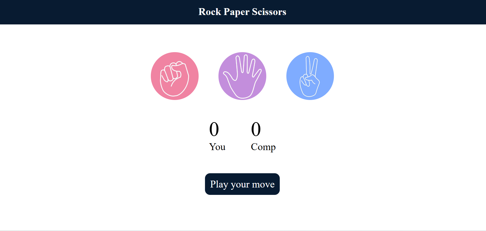
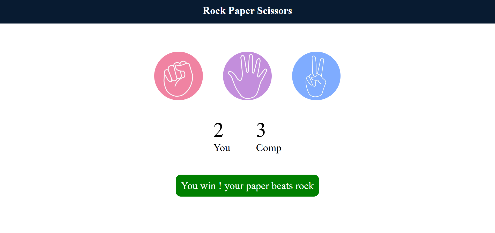
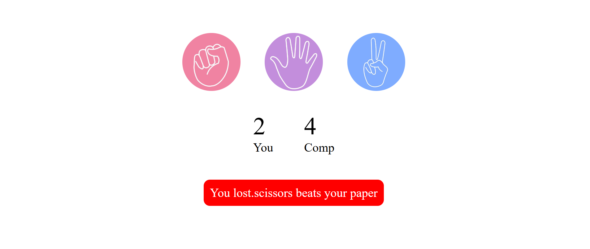

# 🎮 Rock Paper Scissors Game

A simple and interactive Rock Paper Scissors game built using **HTML, CSS, and JavaScript**.

## 📌 Features

* Play Rock, Paper, Scissors against the computer
* Random computer move generation
* Live score tracking
* Win, Lose, and Draw messages
* Dynamic message color changes
* Responsive and user-friendly interface

## 🛠️ Technologies Used

* HTML5
* CSS3
* JavaScript (DOM Manipulation)

## 📂 Project Structure

```text
Rock-Paper-Scissors/
│
├── project.html
├── project.css
├── project.js
└── images/
    ├── rock.png
    ├── paper.png
    └── scissors.png
```

## 🚀 How to Run

1. Clone the repository

```bash
git clone https://github.com/sandhya-mule801/rock-paper-scissors-game.git
```

2. Open the project folder.

3. Run `project.html` in your browser.

## 🎯 Game Rules

* Rock beats Scissors
* Scissors beats Paper
* Paper beats Rock
* Same choices result in a Draw

## 📸 Screenshot

```
### Home Screen


### Game Play


### Result Screen

```

## 📚 What I Learned

* JavaScript Event Listeners
* DOM Manipulation
* Query Selectors
* Functions and Conditional Logic
* Dynamic UI Updates
* Score Tracking

## 👩‍💻 Author

**Sandhya Mule**

BCS Student | Python Full Stack Developer

GitHub: https://github.com/sandhyamule801

## ⭐ If you like this project

Give it a star ⭐ on GitHub and feel free to contribute or provide feedback.
